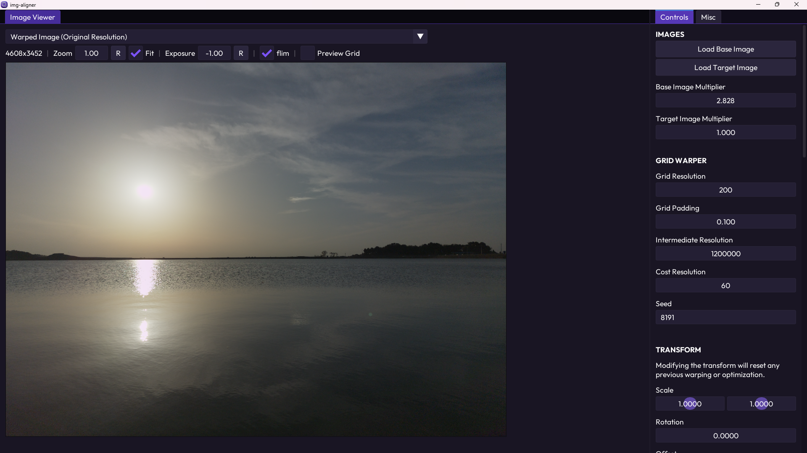
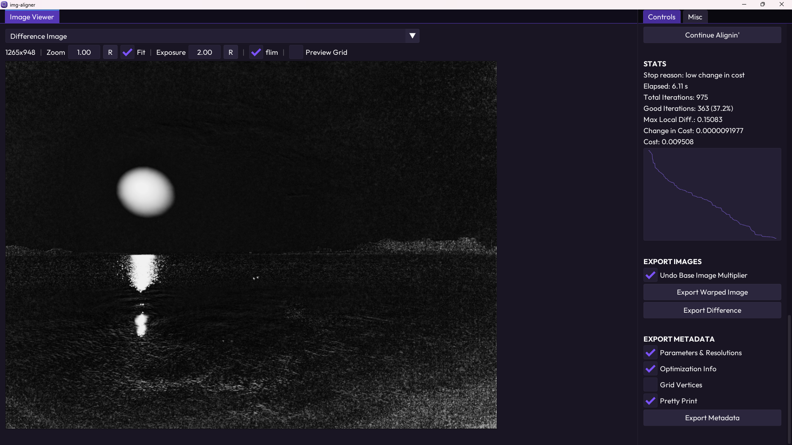

# img-aligner





img-aligner lets you warp an image (called the __base image__) to look
like another, __already similar__ image (the __target image__).

# Why

My personal motivation for this project was to perspective-align two or more
photos with different exposure durations taken from the same scene and almost
the same camera angle. This can be used in __HDR fusion__ where we mix photos
from the same scene with different exposure levels to get a clean, noiseless
linear image that we can further work on (e.g. by applying a view transform,
commonly called a tone mapper).

We can do this by using the darker images to capture details in the highlights
(sky, headlights, etc.) since the image is dark enough to prevent overexposure
and clipping, and we can use the brighter photos to get clean and noise-free
shadows. Again, darker images prevent overexposure or clipping in bright areas,
and brighter images prevent noise in dark areas. By combining them, we can get
the best of both worlds. I usually do this with a custom shader node setup I've
made in [Blender](https://www.blender.org/).

HDR fusion requires both the scene and the camera to be fully stationary
because there's a delay between each shot (not to mention motion blur in images
with higher exposure times). Using a tripod can help, but it's not always an
option. Sometimes, I just need to pull out my phone and, using
[Open Camera](https://opencamera.org.uk/), press capture in the
"Exposure Bracket" mode which will automatically take 5 RAW (DNG) images with
varying exposure levels. Obviously, this introduces tiny movements simply from
my hands.

Despite being tiny, these movements are still large enough to ruin the
images for HDR fusion by introducing artifacts, so what I needed was a program
that aligns these "Exposure Bracket" images. Adobe Photoshop has a similar
feature, but it doesn't seem to work for images in linear color spaces with
32-bit floating-point data, and I don't wanna rely on paid Adobe software (or
any Adobe software for that matter).

As a side note, if you're curious, I use [darktable](https://www.darktable.org)
to convert DNG files from my phone to OpenEXR images in Linear BT.709 while
also applying corrections and minimal processing.

# How

The program uses grid warping to distort the __base image__ to match the
__target image__. An evolution algorithm is used for optimization to minimize
the "cost". To calculate the cost, we render the per-pixel logarithmic
difference (between the warped base image and the target image) into what we
call the __difference image__ which we then downscale to a really tiny
resolution like 8x6 (called the __cost resolution__) and store it in the
__cost image__. The downscaling is done in a smooth way and samples all
necessary pixels to avoid aliasing.

Finally, we find the __maximum and average__ value in the pixels of the cost
image. The average (called the __average difference__) becomes our cost value,
which is what we're trying to minimize. The maximum (called the
__maximum local difference__), however, is just there to make sure we don't
introduce local differences while decreasing the average difference. If the cost
resolution is 1x1, this will have no effect, but if the cost resolution is too
high, it can slow down the optimization.

Apart from warping, a basic linear transform can be applied to the grid by the
user. When optimization starts, it will jitter this transforma around to
potentially lower the cost before warp optimization.

## The Algorithm

Here's what the algorithm looks like in every iteration:
1. Do one of the following based on the number of iterations.
   - Generate a random grid transform jittered around the initial transform set
   by the user.
   - Warp the grid vertices using a gaussian distribution with a random center,
   radius, direction, and strength. The ranges of the random values are
   calculated based on parameters (warp strength, grid resolution, etc.).
2. Recalculate the cost (average difference) and the maximum local difference
(max value in the cost image).
3. If (cost > previous iteration's cost) or (max local diff. > initial max) then
undo the warping.
4. Break the loop if stop conditions are met.

Note that every iteration, we compare the cost after warping to the cost before
warping (stored in the previous iteration). However, for the maximum local
difference, we only compare it to the initial maximum local difference that we
got in the beginning, and not the one from the previous iteration.

## Performance

For increased performance and efficiency, grid warping and cost calculation are
performed at a lower resolution (called the __intermediate resolution__) on the
graphics processing unit (GPU) using the Vulkan API.

# Color Spaces & Image Formats

Unlike typical images you might see on the internet which can only store RGB
(red, green, blue) values in the [0, 1] range, linear images allow any real
number (even negative) for the RGB values in their pixels. img-aligner performs
its calculations in a linear color space using 32-bit floating point values.

img-aligner supports the [OpenEXR](https://openexr.com) image format for linear
images and PNG and JPEG for nonlinear images. All linear images are assumed to
be in Linear BT.709 I-D65 (AKA Linear Rec. 709) or something similar like Linear
BT.2020 I-E. Nonlinear images will go through an sRGB to Linear BT.709
conversion upon loading and the opposite when exporting.

img-aligner always assumes your display device uses the sRGB standard. If you're
using a P3 or BT.2020 device, linear images that were originally intended to
work in BT.709 might look overly vibrant on your display. This only affects how
you view images and not how they're processed or stored in memory.

If you're curious, I really tried adding the
[OpenColorIO](https://opencolorio.org/) and
[OpenImageIO](https://github.com/OpenImageIO/oiio)
libraries for proper color management and image IO (like in
[RealBloom](https://github.com/bean-mhm/realbloom)), but they were painfully
hard to configure and build with CMake, and I got errors after errors.

# How to Use

This [step-by-step tutorial](docs/v0.1.0-alpha/tutorial.md) contains most of
what you need to know to get started with img-aligner.

# Command Line Interface

To batch-process multiple images, you can call img-aligner from a terminal
or another program with the `--cli` argument to enable command line mode.
If no other arguments are provided, a help text will be printed.

```bash
img-aligner --cli
```

> [!NOTE]
> Most command line arguments still have an effect in GUI mode. For example, you
> can use `--gpu -1` to manually choose a physical device (GPU) at the start of
> the program, or `--silent` to disable logging. The help message explains
> every option and flag.

Check out `demo/exposure-bracket-batch-processing` for a number of
exposure-bracketed images, a Python script that uses img-aligner's CLI to
align those images, and a Blender file for fusing the aligned images into a
single 32-bit linear image and minor post processing.

# How to Run

You can find the latest release in
[Releases](https://github.com/bean-mhm/img-aligner/releases).

# How It's Made

This project is written in C++20 with
[Visual Studio Code](https://code.visualstudio.com/) and uses mainly the
following libraries.

| Library | Used for |
|--|--|
| [CLI11](https://github.com/CLIUtils/CLI11) | Command line interface |
| [GLFW](https://www.glfw.org/) | Window management |
| [Dear ImGui](https://github.com/ocornut/imgui) | Graphical user interface |
| [NFD Extended](https://github.com/btzy/nativefiledialog-extended) | Native file dialogs |
| [beva](https://github.com/bean-mhm/beva) | Vulkan wrapper |
| [OpenEXR](https://openexr.com) | Reading and writing OpenEXR images |
| [stb_image](https://github.com/nothings/stb) | Reading images |
| [GLM](https://github.com/g-truc/glm) | Math |
| [nlohmann/json](https://github.com/nlohmann/json) | JSON serialization |

# How to Build

This project uses CMake as its build system (if it works it works).

## Tools

Make sure you've installed [Git](https://git-scm.com/) (version control),
[CMake](https://cmake.org/), the [Ninja](https://ninja-build.org/) build system,
a text editor or an IDE (like
[Visual Studio Code](https://code.visualstudio.com/)), and proper C++ compilers.

On Windows, you can use [MSYS2](https://www.msys2.org/) which comes with the
MinGW compilers and a whole lot of other useful tools and libraries.

## Building

> [!NOTE]
> A basic knowledge of Linux commands is required (`cd`, `mkdir`, `rm`, relative
> paths, etc.).

1. Open up a terminal and switch to your development directory. On Windows, you
can use Git Bash which is automatically installed when you install Git for
Windows.

2. Clone the repository and switch the working directory to it.
```bash
git clone https://github.com/bean-mhm/img-aligner.git
cd img-aligner
```

3. Create a `build` directory and `cd` to it.
```bash
# delete if it already exists
rm -rf ./build

mkdir build
cd build
```

4. Generate CMake configuration files with Ninja.

```bash
cmake -G "Ninja" ..
```

Make sure you have a stable internet connection so that unavailable packages
can be fetched online. You only need to regenerate this in certain cases, like
when you add or remove source files, modify `CMakeLists.txt`, or switch between
debug and release builds.

5. Build & Run.
```bash
# build in debug mode
cmake --build . --config Debug

# or release mode
cmake --build . --config Release

# run
./bin/img-aligner
```
